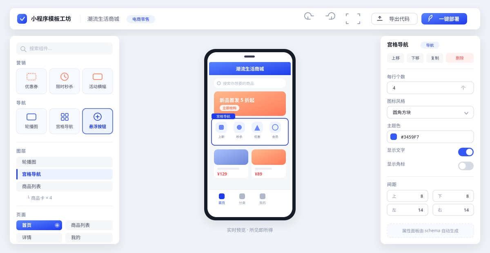
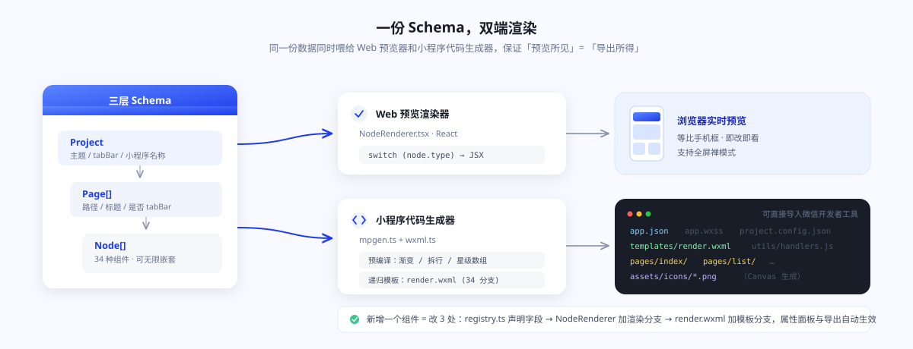

<div align="center">


# 小程序模板工坊 · MiniApp Template Studio

**浏览器里可视化搭建，一键导出可直接运行的微信小程序完整源码。**

15 套行业模板 · 34 个业务组件 · 实时手机预览 · 零命令行部署

[](https://xinyuzjj.github.io/miniapp-template-studio/)
[](https://github.com/xinyuzjj/miniapp-template-studio/actions/workflows/deploy.yml)
[](./LICENSE)

[**→ 打开在线演示**](https://xinyuzjj.github.io/miniapp-template-studio/) · [功能特性](#-功能特性) · [快速开始](#-快速开始) · [一键部署](#-一键部署到微信开发者工具) · [架构说明](#-架构说明)

</div>

---

## 这是什么

一个纯前端的微信小程序**低代码生成器**。选一套行业模板 → 在画布上改文案改配色 → 点「导出代码」，拿到的是一份**结构完整、可直接导入微信开发者工具运行**的小程序工程（含 `app.json`、分页、WXSS 主题、事件处理、PNG 图标、`project.config.json`）。

不需要后端，不需要注册账号，不需要写一行代码。整个工具跑在浏览器里，导出用 JSZip 在本地打包，数据不出本机。

> 想直接看效果？**[点这里打开在线演示 →](https://xinyuzjj.github.io/miniapp-template-studio/)**

---

## ✨ 功能特性

### 1. 15 套行业模板，开箱即用

每套模板都是**多页面完整业务闭环**（首页 / 列表 / 详情 / 表单 / 我的），不是单页 Demo。

| 模板 | 行业 | 模板 | 行业 |
|---|---|---|---|
| 电商商城 | 电商零售 | 健身运动 | 运动健身 |
| 餐饮点餐 | 本地餐饮 | 家政服务 | 到家服务 |
| 美业预约 | 美业服务 | 二手交易 | 二手闲置 |
| 企业官网 | 企业服务 | 个人作品集 | 创意个人 |
| 教育培训 | 教育培训 | 汽车服务 | 汽车后市场 |
| 房产租房 | 房产家居 | 社区团购 | 社区生鲜 |
| 酒店民宿 | 酒旅住宿 | 效率工具 | 效率工具 |
| 医疗健康 | 医疗健康 | | |

### 2. 34 个业务组件，六大分组

不是「div / span」级别的原子组件，而是**开箱即用的业务模块**：

| 分组 | 组件 |
|---|---|
| **基础** | 自由容器、标题栏、文字、单图、**视频**、分割线、空白间距、页脚信息 |
| **导航** | 搜索栏、公告栏、轮播图、宫格导航、分类标签、**悬浮按钮** |
| **营销** | 优惠券、限时秒杀、活动横幅、倒计时 |
| **交易** | 商品列表、店铺信息、结算栏、价格套餐 |
| **内容** | 文章列表、用户评价、团队介绍、常见问题、流程步骤、数据统计、时间轴、**富文本** |
| **表单** | 预约表单、门店地图、联系方式、服务保障 |

每个组件的属性面板由 schema 自动生成 —— 新增组件只需在 `registry.ts` 里声明 `fields`，编辑器 UI 无需改动。

### 3. 可视化编辑器

<div align="center">

</div>

- **左侧**：组件库（支持搜索）、图层树、页面管理
- **中间**：等比手机预览，所见即所得，支持全屏禅模式
- **右侧**：属性面板（文本 / 数字 / 颜色 / 开关 / 下拉 / 图片 / 多行文本）+ 间距样式
- **页面管理**：新增、复制、排序、设为首页、tabBar 开关
- **编辑体验**：撤销/重做、跨页复制粘贴、创建副本、上移/下移

**键盘快捷键**

| 快捷键 | 作用 | 快捷键 | 作用 |
|---|---|---|---|
| `Ctrl/⌘ + Z` | 撤销 | `Ctrl/⌘ + C` | 复制组件 |
| `Ctrl/⌘ + Shift + Z` | 重做 | `Ctrl/⌘ + V` | 粘贴组件 |
| `Ctrl/⌘ + Y` | 重做 | `Delete` / `Backspace` | 删除组件 |
| `Ctrl/⌘ + D` | 创建副本 | `↑` / `↓` | 上移 / 下移 |

### 4. 主题一键换肤

内置多套配色，改一个主色，所有组件（按钮、标签、价格、图标、tabBar 选中态）联动更新；导出时写进 WXSS 变量与 `app.json` 的 `window` 配置。

### 5. 导出即可运行的完整源码

点「导出代码」下载 zip，目录结构：

```
your-miniapp/
├── app.js / app.json / app.wxss      # 全局配置 + 主题变量
├── project.config.json               # 开发者工具工程配置
├── sitemap.json
├── templates/
│   └── render.wxml                   # 递归渲染模板（34 组件全覆盖）
├── utils/
│   └── handlers.js                   # 统一事件处理（拨号、导航、分享、回顶…）
├── pages/
│   ├── index/                        # 每页 wxml 仅 ~5 行，数据在 js 里
│   ├── list/
│   └── ...
└── assets/icons/                     # Canvas 生成的 PNG 图标 + tabBar 81×81
```

导出前会做一遍预编译：渐变色、特性列表拆行、标签拆分、星级数组、地图占位图等派生字段全部算好写进页面数据，**运行时不做任何字符串解析**。

---

## 🚀 快速开始

```bash
# 克隆
git clone https://github.com/xinyuzjj/miniapp-template-studio.git
cd miniapp-template-studio

# 安装
npm install

# 启动编辑器（http://localhost:5173）
npm run dev
```

其它命令：

| 命令 | 说明 |
|---|---|
| `npm run dev` | 启动开发服务器 |
| `npm run build` | 生产构建到 `dist/` |
| `npm run preview` | 预览生产构建 |
| `npm run typecheck` | TypeScript 类型检查 |
| `npm run smoke` | 冒烟测试：15 套模板全页渲染 + 34 组件渲染 + 代码生成校验 |
| `npm run gen:sample` | 命令行直接生成一份样本小程序源码 |

---

## 📦 一键部署到微信开发者工具

浏览器不能直接启动本机程序，所以「一键部署」的交付物是一个**自带部署脚本的压缩包**：

1. 在编辑器点 **「一键部署」**，自动下载 zip
2. 解压到任意文件夹
3. 双击 **`一键部署.bat`**（macOS 用 `一键部署.sh`）

脚本会自动完成：

- 从 `Program Files` 和注册表多路径探测微信开发者工具 CLI
- 未安装时给出下载链接并友好退出
- 自动打开项目，登录后左侧即是真机预览入口

包内还有 `上传体验版.bat` / `.sh` 与 `部署说明.txt`（图文步骤 + 常见问题）。

> **关于 AppID**：本机预览用测试号即可跑通。**上传 / 正式发布**需要你自己的小程序 AppID —— 在微信公众平台注册后，替换 `project.config.json` 里的 `appid` 字段。

`样本输出/` 目录放了一份已生成的「电商商城」小程序源码，可以直接导入开发者工具看效果。

---

## 🏗 架构说明

### 三层 Schema 驱动双端渲染

<div align="center">

</div>

同一份 Schema 同时喂给两个渲染器，保证「预览所见」= 「导出所得」。

### 递归 WXML 模板：页面文件恒定 5 行

小程序没有 JSX，常规做法是给每个页面生成一大坨 WXML。这里换了个思路 —— 生成**一个**递归模板：

```xml
<!-- templates/render.wxml -->
<template name="mp-node">
  <view wx:if="{{node.type === 'title'}}">...</view>
  <view wx:elif="{{node.type === 'goods'}}">
    <block wx:for="{{node.children}}" wx:for-item="c">
      <template is="mp-node" data="{{node: c, T: T}}" />
    </block>
  </view>
  <!-- 34 个分支，支持任意深度嵌套 -->
</template>
```

于是每个页面的 WXML 只需要：

```xml
<import src="/templates/render.wxml" />
<view class="mp-page" style="background:{{T.pageBg}}">
  <block wx:for="{{NODES}}" wx:for-item="node">
    <template is="mp-node" data="{{node, T}}" />
  </block>
</view>
```

页面 JS 里只有一份 `NODES` 数据。新增组件只改 `render.wxml` 一处，所有页面自动生效。

### 图标：SVG path → Canvas → PNG

小程序 tabBar 只吃 PNG。项目内置 SVG path 表，Web 端直接渲染 SVG；导出时用 Canvas 把用到的图标绘制成 PNG（`p_` 主色 / `s_` 次色 / `w_` 白色三种变体，tabBar 额外出 81×81），只打包实际用到的图标。

### 技术栈

`Vite 5` · `React 18` · `TypeScript 5` · `Tailwind CSS 3` · `zustand 4` · `JSZip` · `lucide-react`

### 目录结构

```
src/
├── core/
│   ├── registry.ts      # 34 个组件定义（含属性面板 schema）
│   ├── icons.ts         # SVG path 图标表
│   ├── palette.ts       # 主题配色
│   └── style.ts         # 样式工具
├── render/
│   ├── NodeRenderer.tsx # Web 端组件渲染（switch by type）
│   └── primitives.tsx   # Icon / 渐变占位等原子件
├── export/
│   ├── mpgen.ts         # 代码生成主流程 + 预编译
│   ├── wxml.ts          # 递归 WXML 模板 + WXSS
│   ├── icons.ts         # Canvas 出图
│   ├── deploy.ts        # 部署脚本生成
│   └── zip.ts           # 打包下载
├── templates/
│   ├── defs.ts / defsB.ts  # 15 套模板定义
│   └── kit.ts              # 模板搭建辅助函数
├── store/useApp.ts      # zustand：历史记录 / 剪贴板 / 页面操作
└── ui/                  # 编辑器界面
```

---

## 🧪 质量保障

`npm run smoke` 在 jsdom 里真实挂载 React 树，逐项校验：

- 15 套模板的全部页面能正常渲染，无 `未知组件`
- `REGISTRY` 里 34 个组件类型逐个渲染
- 生成的页面 JS 中不含 `undefined`
- 编辑器面板、store 操作、本地持久化路径可用

CI（GitHub Actions）在每次 push 时跑 `typecheck` → `smoke` → `build`，全绿才发布到 Pages。

---

## 🗺 Roadmap

- [ ] 组件联动与页面跳转配置（属性面板里选目标页）
- [ ] 自定义组件模板（用户保存自己的组合为可复用区块）
- [ ] 导出产物的 ESLint / 预览截图自检
- [ ] 云端草稿同步（当前为浏览器本地持久化）

---

## 📄 License

[MIT](./LICENSE)

---

<div align="center">

**[→ 立即在线体验](https://xinyuzjj.github.io/miniapp-template-studio/)**

觉得有用的话，给个 ⭐️ 呗

</div>
